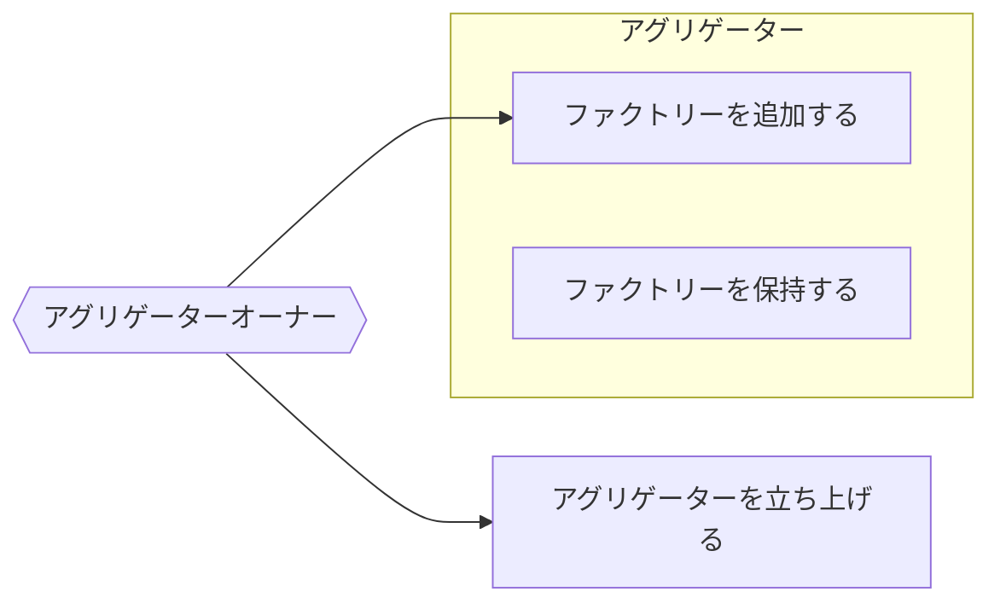

# アクター

- アグリゲーターオーナー
  - アグリゲーターを立ち上げる
  - ファクトリーを追加する
- アグリゲーター
  - ファクトリーを保持する

# ユースケース図

```mermaid
graph LR
    ao{{アグリゲーターオーナー}}

    ao-->AO1[アグリゲーターを立ち上げる]
    ao-->AO2[ファクトリーを追加する]

    A[ファクトリーを保持する]

    subgraph アグリゲーター
        A
        AO2
    end
```
