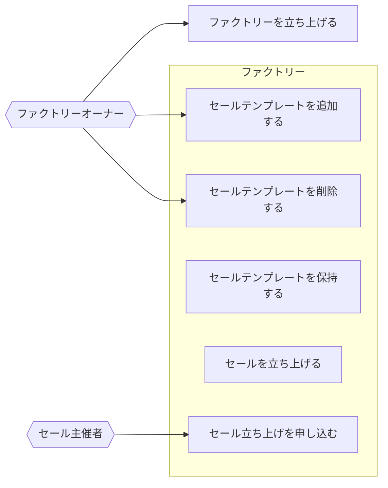

# アクター

- ファクトリーオーナー
  - ファクトリーを立ち上げる
  - セールテンプレートを追加する
  - セールテンプレートを削除する
- ファクトリー
  - セールテンプレートを保持する
  - セールを立ち上げる
- セール主催者
  - セール立ち上げを申し込む

# ユースケース図

```mermaid
graph LR
    fow{{ファクトリーオーナー}}
    sow{{セール主催者}}

    fow-->FOW1[ファクトリーを立ち上げる]
    fow-->FOW2[セールテンプレートを追加する]
    fow-->FOW3[セールテンプレートを削除する]

    F1[セールテンプレートを保持する]
    F2[セールを立ち上げる]

    sow-->SOW1[セール立ち上げを申し込む]

    subgraph ファクトリー
        F1
        F2
        FOW2
        FOW3
        SOW1
    end

```
