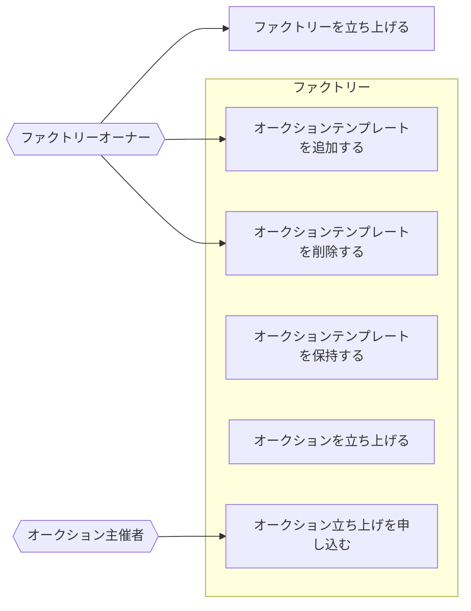

# アクター

- ファクトリーオーナー
  - ファクトリーを立ち上げる
  - オークションテンプレートを追加する
  - オークションテンプレートを削除する
- ファクトリー
  - オークションテンプレートを保持する
  - オークションを立ち上げる
- オークション主催者
  - オークション立ち上げを申し込む

# ユースケース図

```mermaid
graph LR
    fow{{ファクトリーオーナー}}
    sow{{オークション主催者}}

    fow-->FOW1[ファクトリーを立ち上げる]
    fow-->FOW2[オークションテンプレートを追加する]
    fow-->FOW3[オークションテンプレートを削除する]

    F1[オークションテンプレートを保持する]
    F2[オークションを立ち上げる]

    sow-->SOW1[オークション立ち上げを申し込む]

    subgraph ファクトリー
        F1
        F2
        FOW2
        FOW3
        SOW1
    end

```
