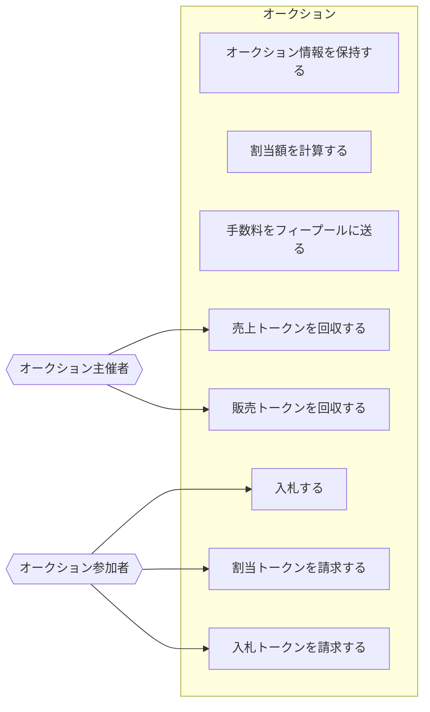

# アクター

- オークション
  - オークション情報を保持する
  - 割当額を計算する
  - 手数料をフィープールに送る
- オークション主催者
  - 売上トークンを回収する
  - 販売トークンを回収する
- オークション参加者
  - 入札する
  - 割当トークンを請求する
  - 入札トークンを請求する

## ユースケース図

```mermaid
graph LR
    sow{{オークション主催者}}
    spa{{オークション参加者}}

    S1[オークション情報を保持する]
    S2[割当額を計算する]
    S3[手数料をフィープールに送る]

    sow-->SOW1[売上トークンを回収する]
    sow-->SOW2[販売トークンを回収する]

    spa-->SPA1[入札する]
    spa-->SPA2[割当トークンを請求する]
    spa-->SPA3[入札トークンを請求する]
    subgraph オークション
        S1
        S2
        S3
        SOW1
        SOW2
        SPA1
        SPA2
        SPA3
    end
```
