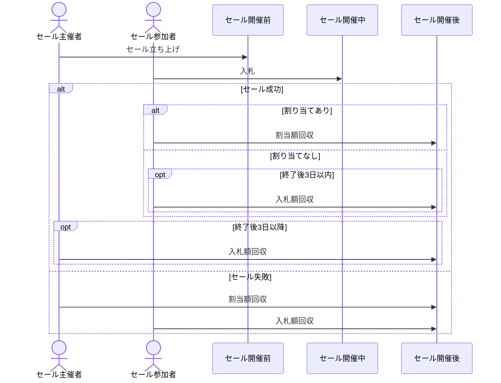

# バルクオークション
## 概要
パーミッションレスIBAO(Initial Bulk Auction Offering)プラットフォーム。

### Bulk Auctionとは
主催者によって提供される一定量のトークンを入札者全員で山分け分配するオークション。

参加者（入札者）は総入札額に対する個々の入札割合と同じ割合のトークンを得る。

全員が同じ価格でトークンを得ることになるため、入札のタイミングによる有利不利はない。割り当て額がいくらになるかは最終の総入札額が決まるまでわからない。

入札額が大きいほどトークンの価格が高く（割当量が少なく）なり、小さいほど安く（割当量が多く）なる。

## ファクトリー仕様
- セールテンプレート
  - byts32（utf8を変換したもの）に対応するアドレスで管理される
  - 上書きはできない
- セールデプロイ
  - minimal proxyパターンでデプロイする
  - テンプレートを用いないデプロイはできない
  - テンプレートアドレスとナンス（セールデプロイごとにインクリメント）をsaltにしたCREATE2によるデプロイ
  - デプロイ時に売上トークンの転送を行う

### オーナー権限
- 手数料の回収
- セールテンプレート追加
- セールテンプレート削除

## セール仕様
### 固定パラメータ
- 総入札限度量
  - 1e27
- セールトークン限度量
  - 1e50
- 手数料
  - 最終入札量の1%

### 必要パラメータ
- bytes32 templateName
  - 利用するテンプレート
  - 条件：実在
- address tokenAddr
  - セールにかけるトークンのアドレス
  - 条件：0アドレスでないこと
- address owner
  - セールオーナー
  - 条件：0アドレスでないこと
- uint allocatedAmount
  - セールにかけるトークンの量
  - 条件：1以上、1e50以下
- uint startingAt
  - セール開始時間
  - 条件：現在ブロック時間より後
- uint eventDuration
  - セール開催期間
  - 条件：1日～30日間
- uint minRaisedAmount
  - 最小入札量
  - 条件：0以上、1e27以下

### フロー

## ユースケース
[usecase.md](./usecase.md) を参照

## シーケンス
[sequence.md](./sequence.md) を参照
