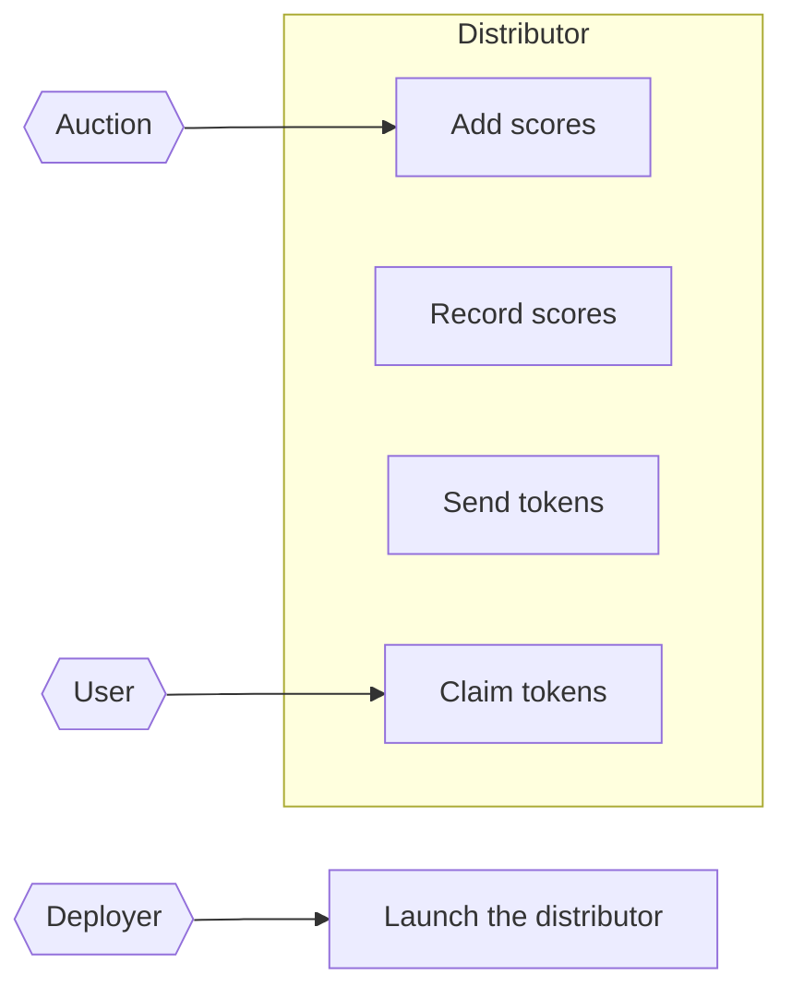

# Actors

- Deployer
  - Launch the distributor.
- Auction
  - Add scores.
- Distributor
  - Send tokens.
- User
  - Claim tokens.

# Use Case Diagram

```mermaid
graph LR
    dp{{Deployer}}
    auc{{Auction}}
    user{{User}}

    dp-->DP1[Launch the distributor]

    auc-->AUC1[Add scores]

    DIST1[Record scores]
    DIST2[Send tokens]

    user-->USER1[Claim tokens]

    subgraph Distributor
        DIST1
        DIST2
        AUC1
        USER1
    end

```