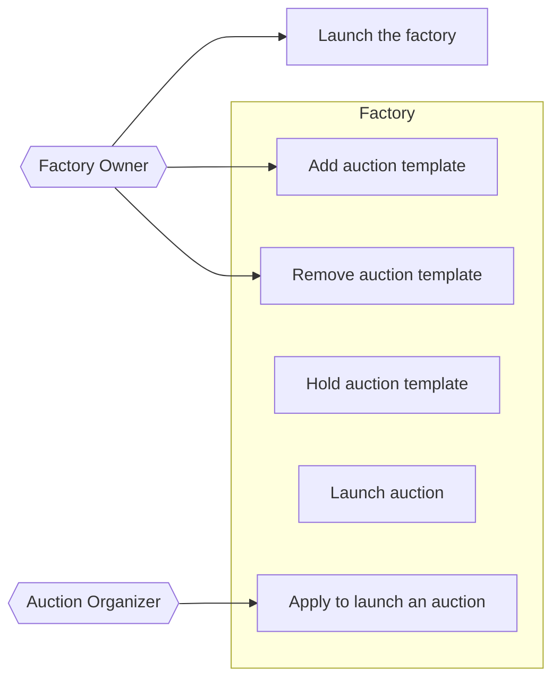

# Actors

- Factory Owner
  - Launch the factory
  - Add auction templates
  - Remove auction templates
- Factory
  - Hold auction templates
  - Launch auctions
- Auction Organizer
  - Apply to launch an auction

# Use Case Diagram

