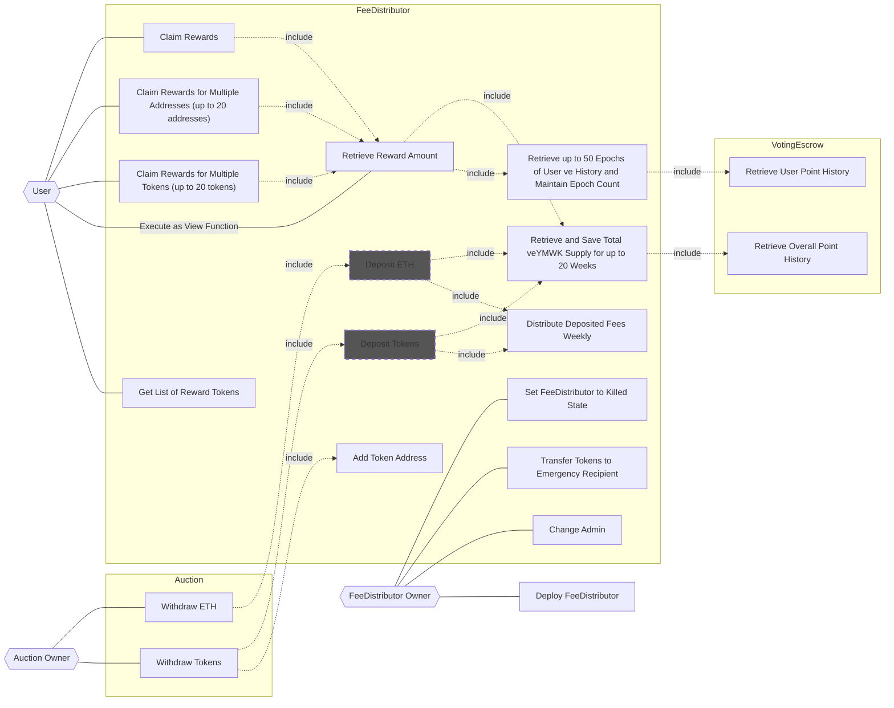

## Actors

- **User** (Any user or contract)
  - Retrieve reward amounts
  - Claim rewards
  - Claim rewards for multiple addresses (up to 20 addresses) at once
  - Claim rewards for multiple tokens (up to 20 tokens) at once
  - Get the list of reward tokens
- **Auction Owner**
  - Withdraw tokens
  - Withdraw ETH
- **[Auction](../Template/index.md)**
  - Add token addresses
  - Transfer tokens to the FeeDistributor
- **FeeDistributor Owner**
  - Deploy the FeeDistributor
  - Change the admin
  - Transfer tokens to the emergency token recipient
  - Set the FeeDistributor to the killed state
- **FeeDistributor**
  - Distribute deposited fees weekly and maintain them
  - Distribute the weekly allocated rewards to veYMWK holders according to their veYMWK balances each week
  - Retrieve up to 50 epochs of user ve history and maintain the epoch count
  - Retrieve up to 20 weeks of total veYMWK supply
  - Maintain the total veYMWK supply at the beginning of each week
- **[VotingEscrow](./index.md)**
  - Manage veYMWK balances

## Use Case Diagram

