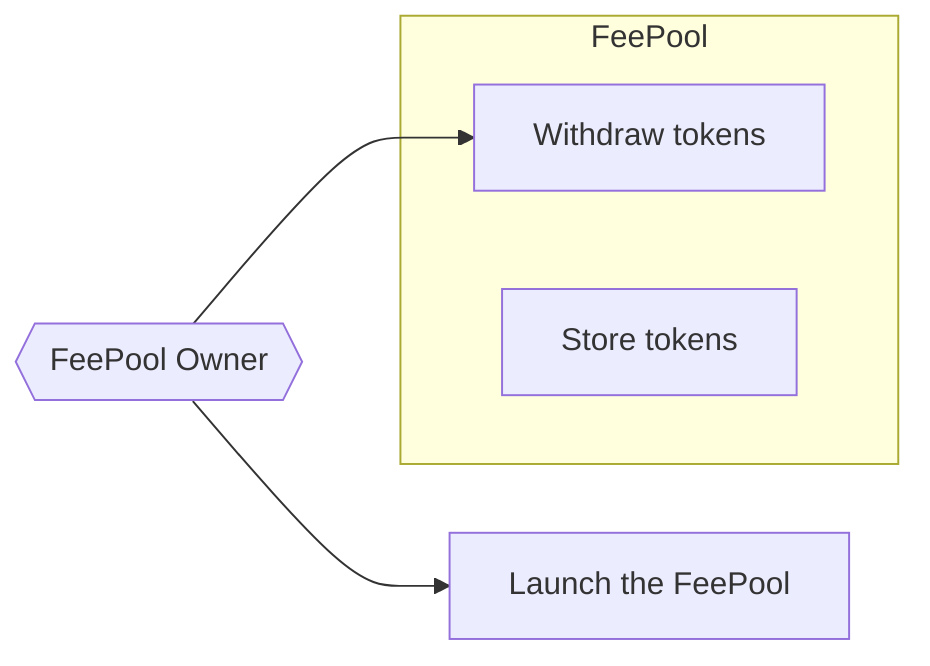

# Actors

- FeePool Owner
  - Launch the FeePool
  - Withdraw tokens
- FeePool
  - Store tokens

# Use Case Diagram

```mermaid
graph LR
    fpow{{FeePool Owner}}

    fpow-->FPOW1[Launch the FeePool]
    fpow-->FPOW2[Withdraw tokens]

    F1[Store tokens]

    subgraph FeePool
        F1
        FPOW2
    end

```
