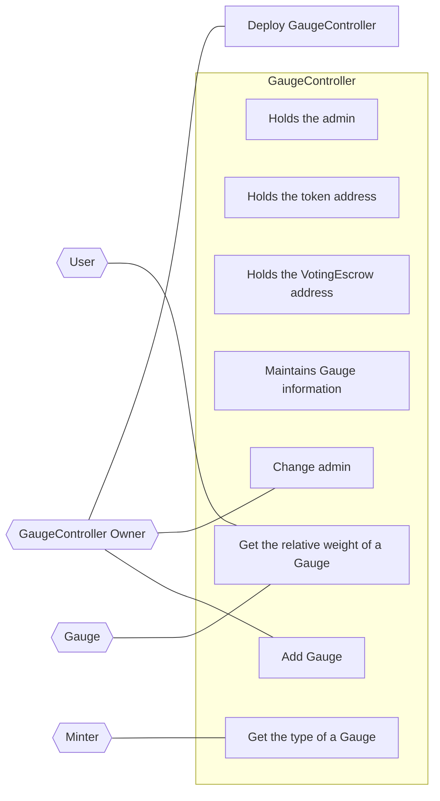

## Actors

- **GaugeController**

  - Holds the admin
  - Holds the token address
  - Holds the VotingEscrow address
  - Maintains Gauge information
  - Maintains weight information per type
  - Calculates the relative weight of a Gauge

- **GaugeController Owner**

  - Deploys the GaugeController
  - Changes the admin
  - Adds a Gauge

- **User**

  - Gets the type of a Gauge
  - Gets the total weight
  - Gets the relative weight of a Gauge

- **Gauge**

  - Gets the relative weight of the Gauge
  - **Checkpoint**
    - Does nothing in V1

- **Minter**
  - Gets the type of a Gauge

## Use Case Diagram

