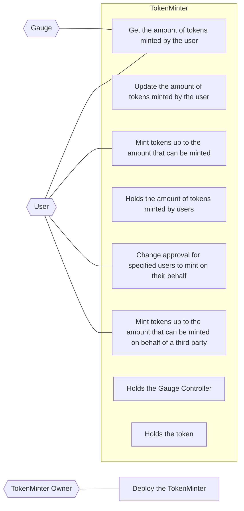

## Actors

- **Gauge**
  - Get the amount of tokens minted by users
- **User**
  - Mint tokens up to the amount that can be minted
  - Get the amount of tokens minted by the user
  - Change approval for specified users to mint on their behalf
  - Mint tokens up to the amount that can be minted on behalf of a third party
- **TokenMinter**
  - Holds the token
  - Holds the Gauge Controller
  - Updates the amount of tokens minted by users
  - Holds the amount of tokens minted by users
- **TokenMinter Owner**
  - Deploys the TokenMinter

## Use Case Diagram

