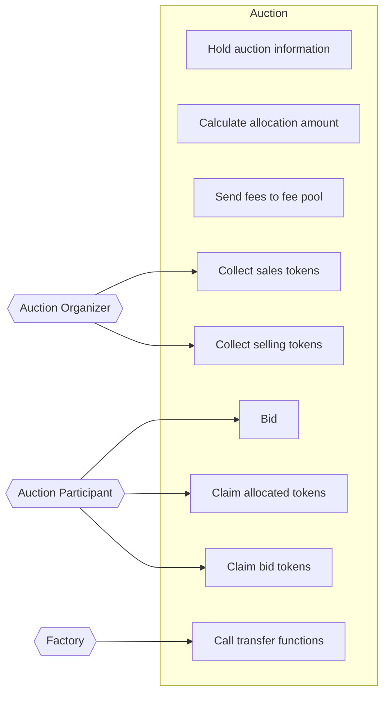

# Actors

- Auction
  - Holds auction information
  - Calculates allocation amount
  - Sends fees to the fee pool
  - Holds transfer functions
- Auction Organizer
  - Collects sales tokens
  - Collects selling tokens
- Auction Participants
  - Place bids
  - Claim allocated tokens
  - Claim bid tokens
- Factory
  - Calls transfer functions

## Use Case Diagram

