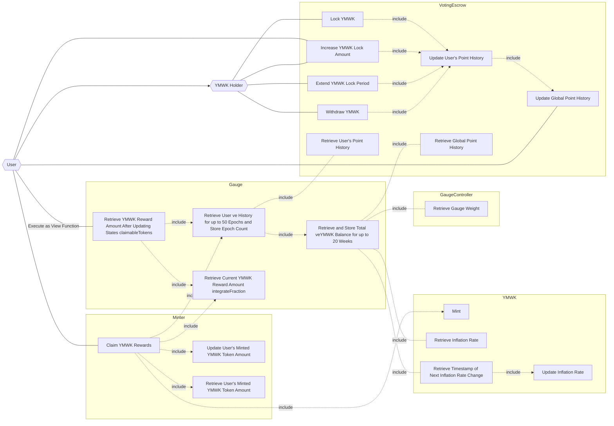

## Actors

- **User**
  - Any user or contract
- **YMWK Holder**
  - Holder of YMWK tokens
  - Assumed to be an EOA (Externally Owned Account) or contract
- **[VotingEscrow](./index.md)**
  - Issues non-transferable veYMWK by locking YMWK tokens
  - Manages veYMWK balances
- **[RewardGauge](../RewardGaugeV1/index.md)**
  - Calculates and maintains YMWK reward information for veYMWK holders
- **[Minter](../MinterV1/index.md)**
  - The Minter set for the YMWK token
  - Calls the mint function of YMWK to mint a specified amount of YMWK
- **[YMWK](../YamawakeToken/index.md)**
  - YMWK Token

## Use Cases

- **User**
  - Increase the amount of YMWK locked
- **YMWK Holder**
  - Lock YMWK
  - Increase the amount of YMWK locked
  - Extend the YMWK lock period
  - Withdraw YMWK
- **VotingEscrow**
  - Update the user's point history
  - Maintain the user's point history
  - Update the global point history
  - Maintain the global point history
- **Gauge**
  - Retrieve the user's point history
  - Retrieve the global point history
- **GaugeController**
  - Retrieve the weight of the Gauge

## Use Case Diagram

