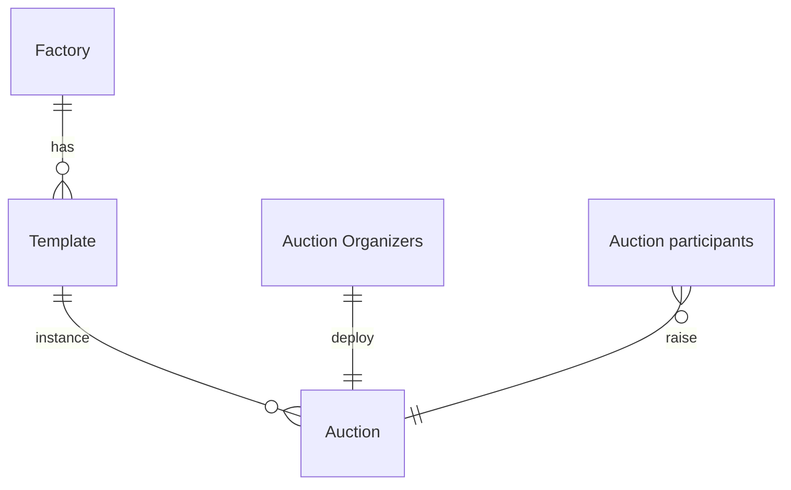

# ER図

```mermaid
erDiagram
    Factory ||--o{ Template : has
    Template ||--o{ Auction : instance
    "Auction Organizers" ||--|| Auction: deploy
    "Auction participants" }o--|| Auction: raise
```