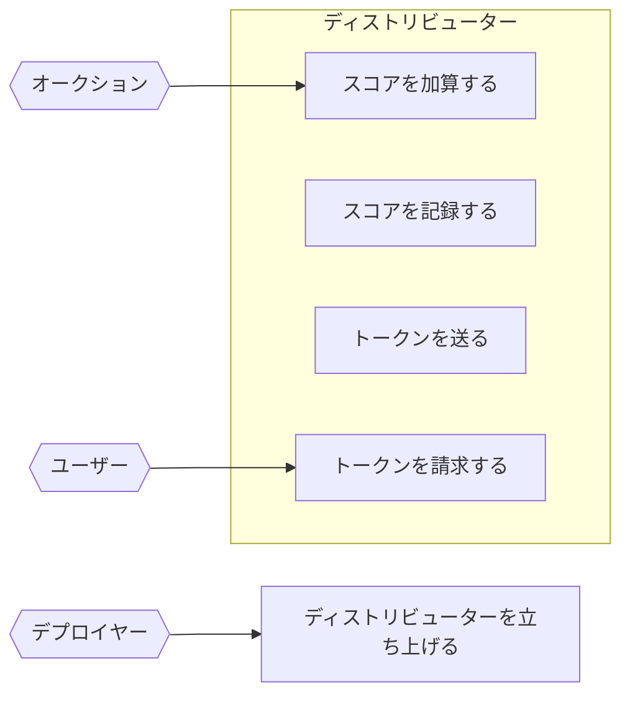

# アクター

- デプロイヤー
  - ディストリビューターを立ち上げる
- オークション
  - スコアを加算する
- ディストリビューター
  - トークンを送る
- ユーザー
  - トークンを請求する

# ユースケース図

```mermaid
graph LR
    dp{{デプロイヤー}}
    auc{{オークション}}
    user{{ユーザー}}

    dp-->DP1[ディストリビューターを立ち上げる]

    auc-->AUC1[スコアを加算する]

    DIST1[スコアを記録する]
    DIST2[トークンを送る]

    user-->USER1[トークンを請求する]

    subgraph ディストリビューター
        DIST1
        DIST2
        AUC1
        USER1
    end

```
