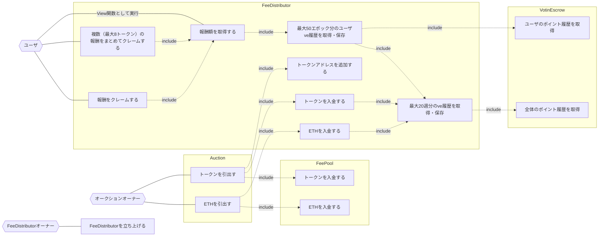

## アクター

- ユーザ
  - 任意のユーザ、またはコントラクト
- オークションオーナー
- FeeDistributorオーナー
  - FeeDistributorコントラクトのオーナー
- FeeDistributor
  - Feeとして徴収した入札トークンをveYMWKホルダーに対して分配する
- [VotingEscrow](./index.md)
  - YMWKトークンをロックすることで移転不可のveYMWKを発行する
  - veYMWKの残高を管理をする
- [FeePool](../FeePool/index.md)
  - 各オークション成功時に徴収される入札トークンの集積所
- [Auction](../Template/index.md)

## ユースケース図

