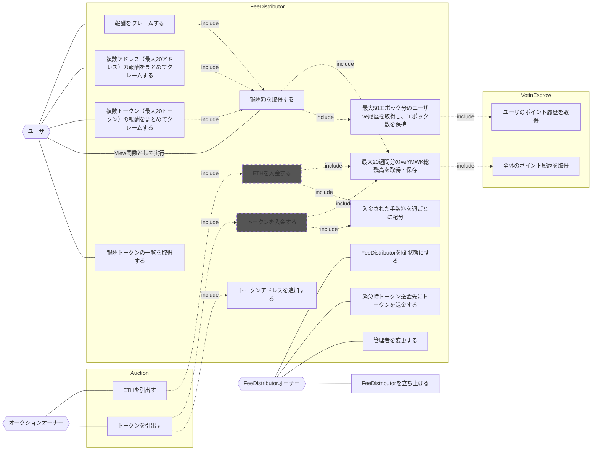

## アクター

- ユーザ（任意のユーザ、またはコントラクト）
  - 報酬額を取得する
  - 報酬をクレームする
  - 複数アドレス（最大20アドレス）の報酬をまとめてクレームする
  - 複数トークン（最大20トークン）の報酬をまとめてクレームする
  - 報酬トークンの一覧を取得する
- オークションオーナー
  - トークンを引出す
  - ETHを引出す
- [Auction](../Template/index.md)
  - トークンアドレスを追加する
  - FeeDistributorにトークンを送金する
- FeeDistributorオーナー
  - FeeDistributorを立ち上げる
  - 管理者を変更する
  - 緊急時トークン送金先にトークンを送金する
  - FeeDistributorをkill状態にする
- FeeDistributor

  - 入金された手数料を週ごとに配分して保持する
  - 週ごとに配分された報酬をveYMWKホルダーに対して各週のveYMWK残高に応じて分配する
  - 最大50エポック分のユーザve履歴を取得し、エポック数を保持する
  - 最大20週間分のveYMWK総残高を取得
  - 各週初め時点でのveYMWK総残高を保持する

- [VotingEscrow](./index.md)
  - veYMWKの残高を管理をする

## ユースケース図

