## アクター

- GaugeController

  - 管理者を保持する
  - トークンアドレスを保持する
  - VotingEscrowアドレスを保持する
  - Gauge情報を保持する
  - ユーザのvote情報を保持する
  - GaugeごとのWeight情報を保持する
  - TypeごとのWeight情報を保持する
  - 合計のWeight情報を保持する
  - TypeのWeightを計算する
  - Typeの合計Weightを計算する
  - Weightの合計を計算する
  - GaugeのWeightを計算する
  - Gaugeの相対Weightを計算する

- GaugeControllerオーナー
  - GaugeControllerを立ち上げる
  - 管理者を変更する
  - Typeを追加する
  - TypeのWeightを変更する
  - Gaugeを追加する
  - GaugeのWeightを変更する
- ユーザ
  - GaugeのTypeを取得する
  - TypeのWeightを取得する
  - Typeの合計Weightを取得する
  - Weightの合計を取得する
  - GaugeのWeightを取得する
  - GaugeのWeight変更に投票する
  - Gaugeの相対Weightを取得する
- Gauge
  - Gaugeの相対Weightを取得する
  - checkpoint
    - GaugeのWeightを計算する
    - Weightの合計を計算する
- Minter
  - GaugeのTypeを取得する

## ユースケース図

```mermaid
graph LR
    user{{ユーザ}}
    owner{{GaugeControllerオーナー}}
    gauge_{{Gauge}}
    minter{{Minter}}

    admin[管理者を保持する]
    token[トークンアドレスを保持する]
    escrow[VotingEscrowアドレスを保持する]
    gauge[Gauge情報を保持する]
    ve[ユーザのvote情報を保持する]
    gauge_weight[GaugeごとのWeight情報を保持する]
    type_weight[TypeごとのWeight情報を保持する]
    weight[合計のWeight情報を保持する]
    calc_type_weight[TypeのWeightを計算する]
    calc_type_weight_sum[Typeの合計Weightを計算する]
    calc_weight_sum[Weightの合計を計算する]
    calc_gauge_weight[GaugeのWeightを計算する]
    calc_gauge_rel_weight[Gaugeの相対Weightを計算する]

    deploy[GaugeControllerを立ち上げる]
    change_admin[管理者を変更する]
    add_type[Typeを追加する]
    change_type_weight[TypeのWeightを変更する]
    add_gauge[Gaugeを追加する]
    change_gauge_weight[GaugeのWeightを変更する]

    get_type_weight[TypeのWeightを取得する]
    get_type_weight_sum[Typeの合計Weightを取得する]
    get_weight_sum[Weightの合計を取得する]
    get_gauge_weight[GaugeのWeightを取得する]
    vote_gauge_weight[GaugeのWeight変更に投票する]
    get_gauge_rel_weight[Gaugeの相対Weightを取得する]
    get_gauge_type[GaugeのTypeを取得する]

    owner --- deploy
    owner --- change_admin
    owner --- add_type
    owner --- change_type_weight
    owner --- add_gauge
    owner --- change_gauge_weight

    user --- get_type_weight
    user --- get_type_weight_sum
    user --- get_weight_sum
    user --- get_gauge_weight
    user --- vote_gauge_weight
    user --- get_gauge_rel_weight

    gauge_ --- get_gauge_rel_weight
    gauge_ --- calc_gauge_weight
    gauge_ --- calc_weight_sum

    minter --- get_gauge_type

    subgraph GaugeController
        direction LR
        admin
        token
        escrow
        gauge
        ve
        gauge_weight
        type_weight
        weight
        calc_type_weight
        calc_type_weight_sum
        calc_weight_sum
        calc_gauge_weight
        calc_gauge_rel_weight

        get_gauge_type
        get_type_weight
        get_type_weight_sum
        get_weight_sum
        get_gauge_weight
        vote_gauge_weight
        get_gauge_rel_weight

        change_admin
        add_type
        change_type_weight
        add_gauge
        change_gauge_weight
    end
```

