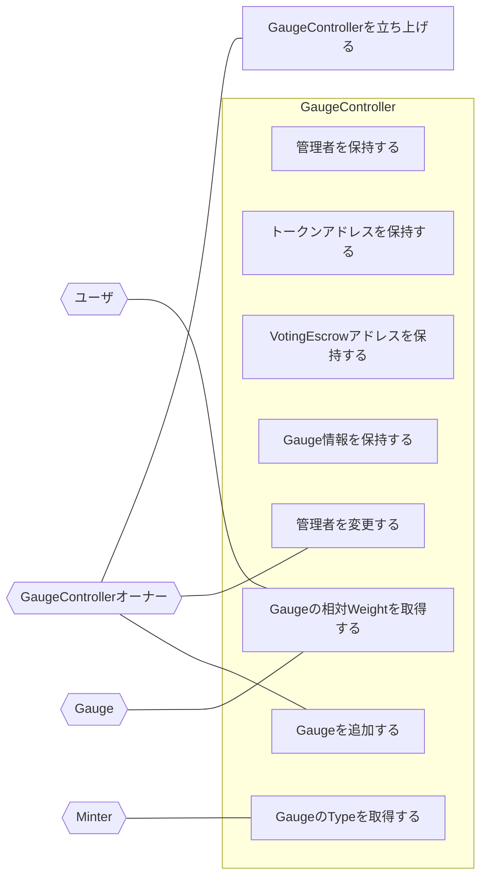

## アクター

- GaugeController

  - 管理者を保持する
  - トークンアドレスを保持する
  - VotingEscrowアドレスを保持する
  - Gauge情報を保持する
  - TypeごとのWeight情報を保持する
  - Gaugeの相対Weightを計算する

- GaugeControllerオーナー
  - GaugeControllerを立ち上げる
  - 管理者を変更する
  - Gaugeを追加する
- ユーザ
  - GaugeのTypeを取得する
  - Weightの合計を取得する
  - Gaugeの相対Weightを取得する
- Gauge
  - Gaugeの相対Weightを取得する
  - checkpoint
    - V1では何もしない
- Minter
  - GaugeのTypeを取得する

## ユースケース図

