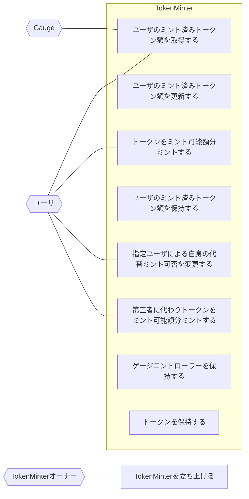

## アクター

- Gauge
  - ユーザのミント済みトークン額を取得する
- ユーザ
  - トークンをミント可能額分ミントする
  - ユーザのミント済みトークン額を取得する
  - 指定ユーザによる自身の代替ミント可否を変更する
  - 第三者に代わりトークンをミント可能額分ミントする
- TokenMinter
  - トークンを保持する
  - ゲージコントローラーを保持する
  - ユーザのミント済みトークン額を更新する
  - ユーザのミント済みトークン額を保持する
- TokenMinterオーナー
  - TokenMinterを立ち上げる

## ユースケース図

