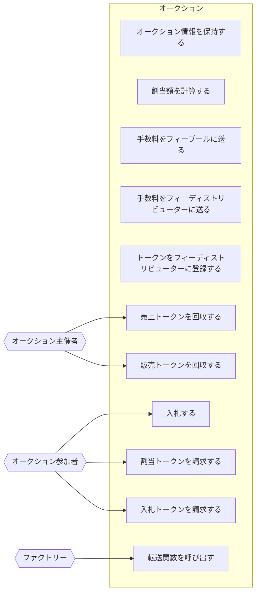

# アクター

- オークション
  - オークション情報を保持する
  - 割当額を計算する
  - 手数料をフィープールに送る
  - 手数料をフィーディストリビューターに送る
  - トークンをフィーディストリビューターに登録する
  - 転送関数を保持する
- オークション主催者
  - 売上トークンを回収する
  - 販売トークンを回収する
- オークション参加者
  - 入札する
  - 割当トークンを請求する
  - 入札トークンを請求する
- ファクトリー
  - 転送関数を呼び出す

## ユースケース図

