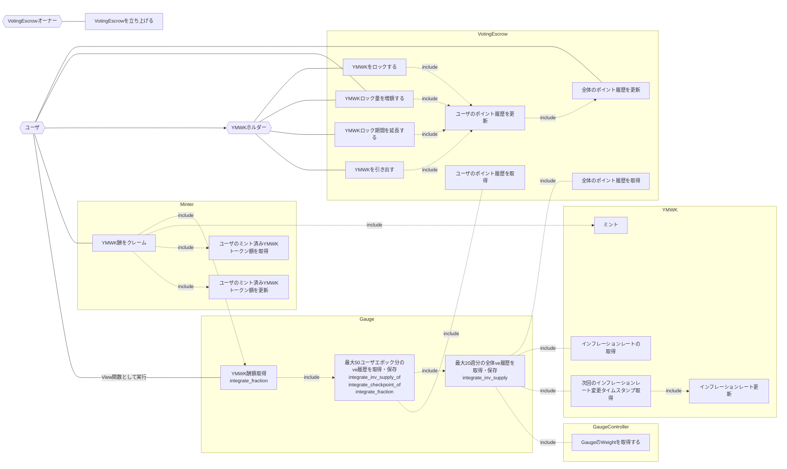

## アクター

- ユーザ
  - 任意のユーザ、またはコントラクト
- YMWKホルダー
  - YMWKトークンのホルダー
  - EOA、コントラクトを想定
    - 参考
      - [VotingEscrow](https://github.com/curvefi/curve-dao-contracts/blob/master/contracts/VotingEscrow.vy#L109)
- [VotingEscrow](./index.md)
  - YMWKトークンをロックすることで移転不可のveYMWKを発行する
  - veYMWKの残高を管理をする
- [Gauge](../GaugeV1/index.md)
  - veYMWKホルダーに対するYMWK報酬情報を計算・保持する
- [Minter](../MinterV1/index.md)
  - YMWKトークンに設定されたMinter
  - YMWKのmint関数を呼びYMWKを指定数発行する
- [YMWK](../YamawakeToken/index.md)
  - YMWKトークン
- VotingEscrowオーナー
  - VotingEscrowコントラクトのオーナー

## ユースケース

- ユーザ
  - YMWK ロック量を増額する
- YMWKホルダー
  - YMWK をロックする
  - YMWK ロック量を増額する
  - YMWK ロック期間を延長する
  - YMWKを引き出す
- VotingEscrow
  - ユーザのポイント履歴を更新
  - ユーザのポイント履歴を保持する
  - 全体のポイント履歴を更新
  - 全体のポイント履歴を保持する
- Gauge
  - ユーザのポイント履歴を取得する
  - 全体のポイント履歴を取得する
- VotingEscrowオーナー
  - VotingEscrowを立ち上げる
  - 管理者を変更する

## ユースケース図

