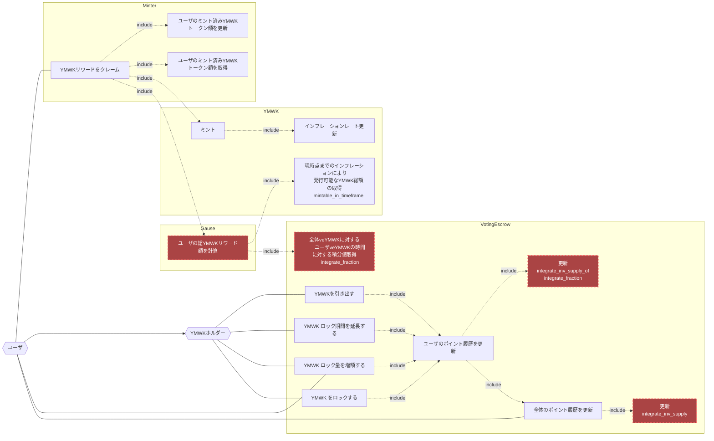

## アクター

- ユーザ
  - 任意のユーザ、またはコントラクト
- YMWKホルダー
  - YMWKトークンのホルダー
  - EOAとsmart_wallet_checkerでwhitelistされたコントラクトウォレットを想定（コントラクトを弾く理由はveYMWKのトークン化を防ぐため）
    - 参考
      - [smart_wallet_checker](./index.md#smart_wallet_checker-publicaddress)
      - [VotingEscrow](https://github.com/curvefi/curve-dao-contracts/blob/master/contracts/VotingEscrow.vy#L109)
- [VotingEscrow](./index.md)
  - YMWKトークンをロックすることで移転不可のveYMWKを発行する
  - veYMWKホルダーに対するリワード情報の管理をする
- Minter
  - YMWKトークンに設定されたMinter
  - YMWKのmint関数を呼びYMWKを指定数発行する
- [YMWK](../YamawakeToken/index.md)
  - YMWKトークン

## ユースケース図

