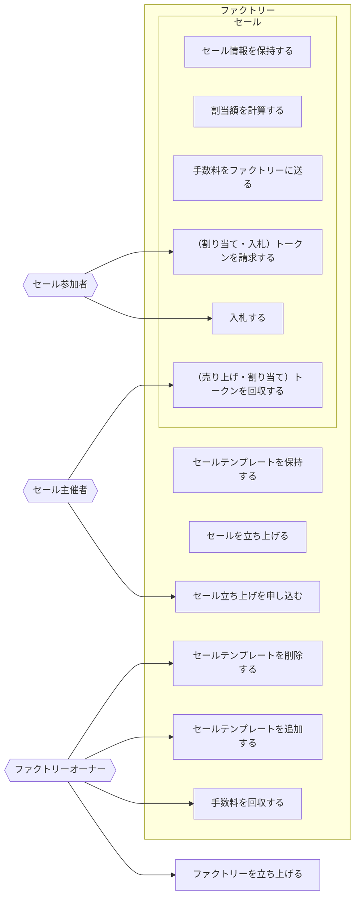

# アクター
- ファクトリーオーナー
  - ファクトリーを立ち上げる
  - 手数料を回収する
  - セールテンプレートを追加する
  - セールテンプレートを削除する
- ファクトリー
  - セールテンプレートを保持する
  - セールを立ち上げる
- セール
  - セール情報を保持する
  - 割当額を計算する
  - 手数料をファクトリーに送る
- セール主催者
  - セール立ち上げを申し込む
  - （売り上げ・割り当て）トークンを回収する
- セール参加者
  - 入札する
  - （割り当て・入札）トークンを請求する

## ユースケース図
